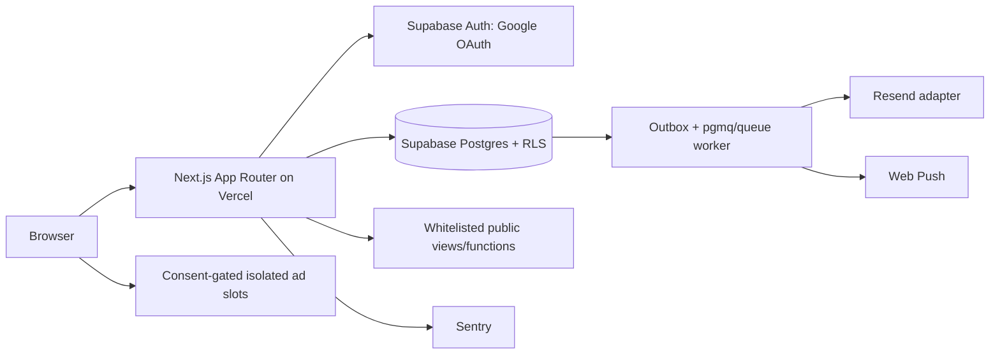
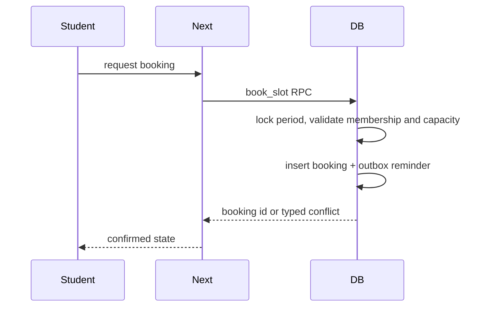

> Purpose: Core architecture and execution specification
> Audience: founders and coding agents
> Prerequisites: `docs/00-INDEX.md`, `docs/DECISIONS.md`, `docs/SYMBOL_REGISTRY.md`
> Owner lane: Shared
> Last verified against SYMBOL_REGISTRY version: v1

# System Overview

## Trust boundaries
Browser code receives only anon key and user session. Service role exists only in server-side Edge Function/cron secrets. Every private row is tenant-scoped and RLS-protected. Public rendering calls published-only `public_*` surfaces. External ad scripts have no access to authenticated DOM by default where isolation mode disables scripts; sensitive marks use tap-to-reveal and never enter analytics.

## Auth flow
Google OAuth callback validates verified email domain against active university domain records server-side. A denied domain returns the access-denied route, does not create membership, and emits a rate-limited security event. Membership and role assignment remain distinct. First global admin is inserted through the one-time audited bootstrap.

## Booking flow

## Ad resolution flow
Page route supplies registered page type and slot. Server resolves active config, consent category, layer switch, page isolation, auth exclusion, network kill state, device rules and frequency cap. Client loads eligible adapter asynchronously in an error boundary with reserved dimensions. Network failure leaves an empty slot.

## Public publication flow
Author saves draft → moderation/review → publication RPC updates state and audit log → public view exposes whitelisted columns → ISR revalidation and sitemap update. Unpublish immediately removes view eligibility and triggers cache invalidation.

## Self-check
- [x] Header and audience are stated.
- [x] Scope, tests, and operational constraints are present.
