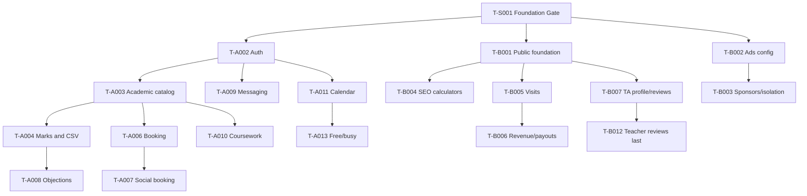

> Purpose: Card DAG and interface dependencies
> Audience: founders and coding agents
> Prerequisites: `docs/DECISIONS.md`, `docs/SYMBOL_REGISTRY.md`
> Owner lane: Shared
> Last verified against SYMBOL_REGISTRY version: v1

# Card Dependency Graph

Cross-lane interfaces: A supplies university/membership, course/offering/staff contracts before B public tenant/course pages and revenue attribution. B supplies publication views, ad resolver and consent contracts before A page layouts. Both use shared audit/outbox/feature flag contracts. Mock interfaces land before consumer UI. Integration checkpoint each week; if contract changes, version DTO and preserve previous consumer compatibility.

The two founder lanes have roughly comparable P1 effort only after shared foundation is excluded; P2/P3 estimates must be rebalanced by splitting cards and moving interface-owned screens. The included principal cards are sequencing anchors and remain intentionally split during execution; they are not a reliable final per-phase ±15% estimate.

## Self-check
- [x] Header and required content are present.
- [x] Naming source and ownership are stated.
